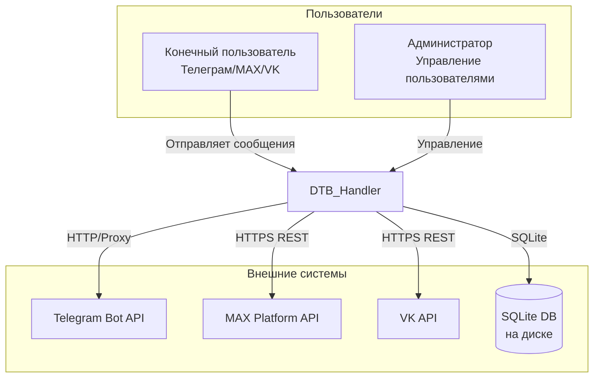
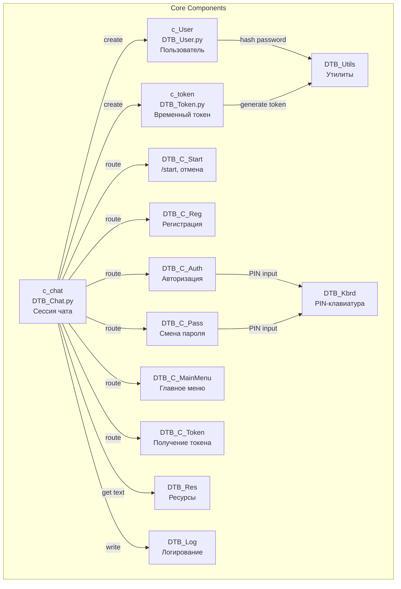
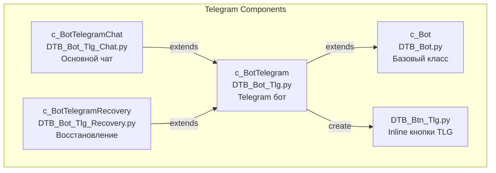
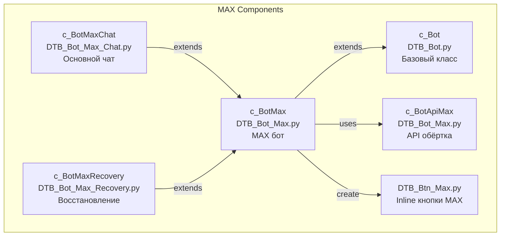
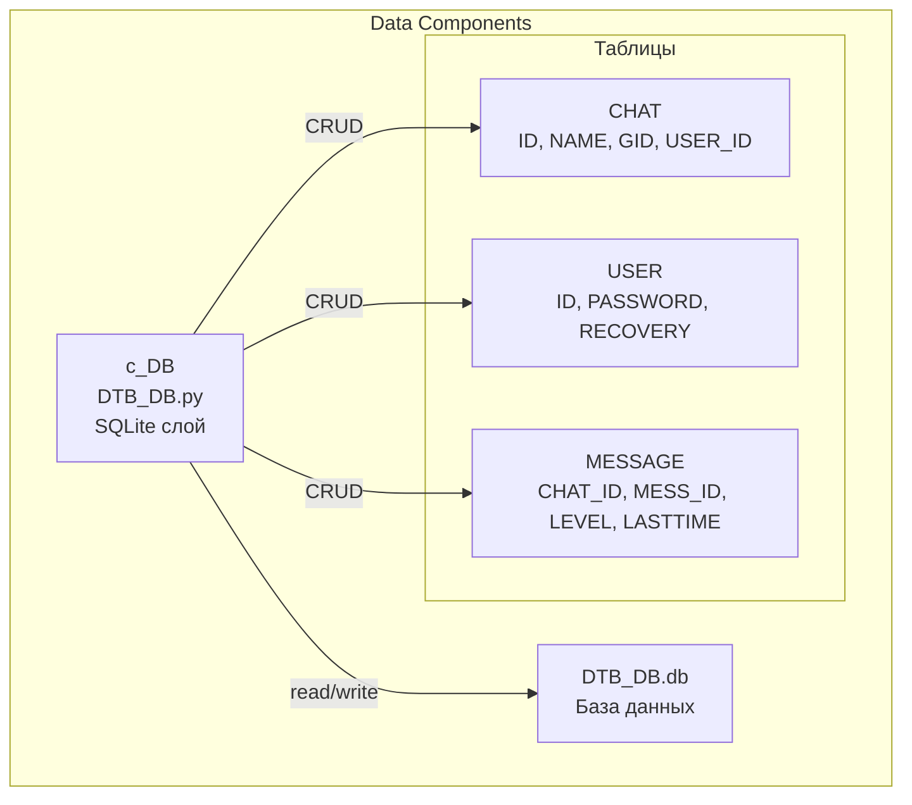
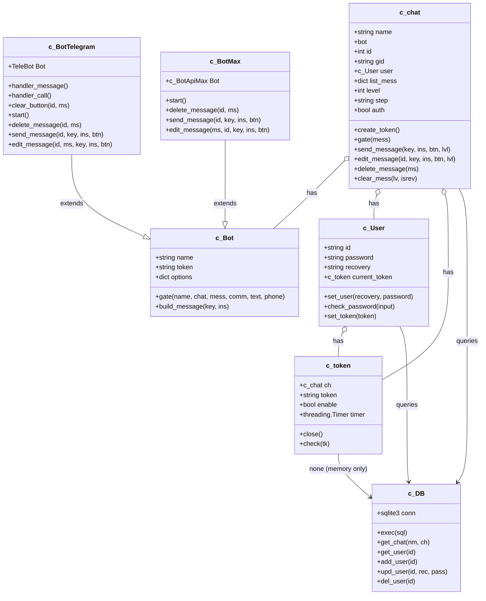
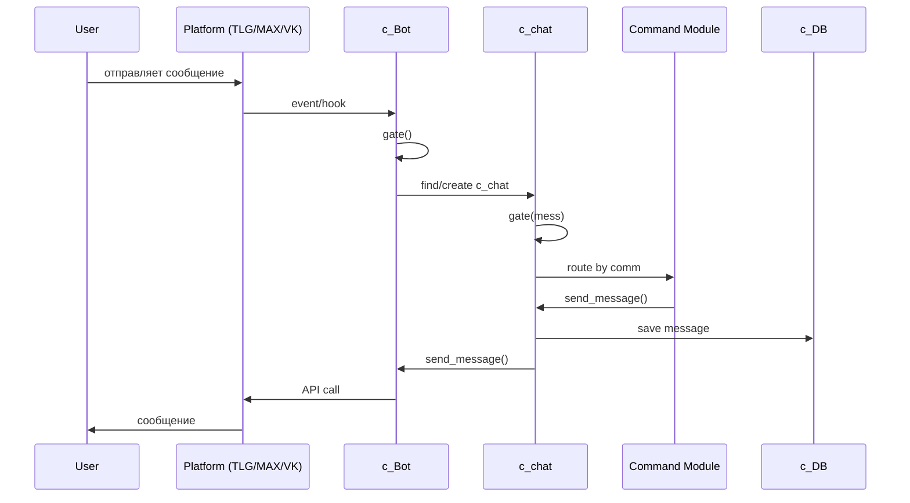
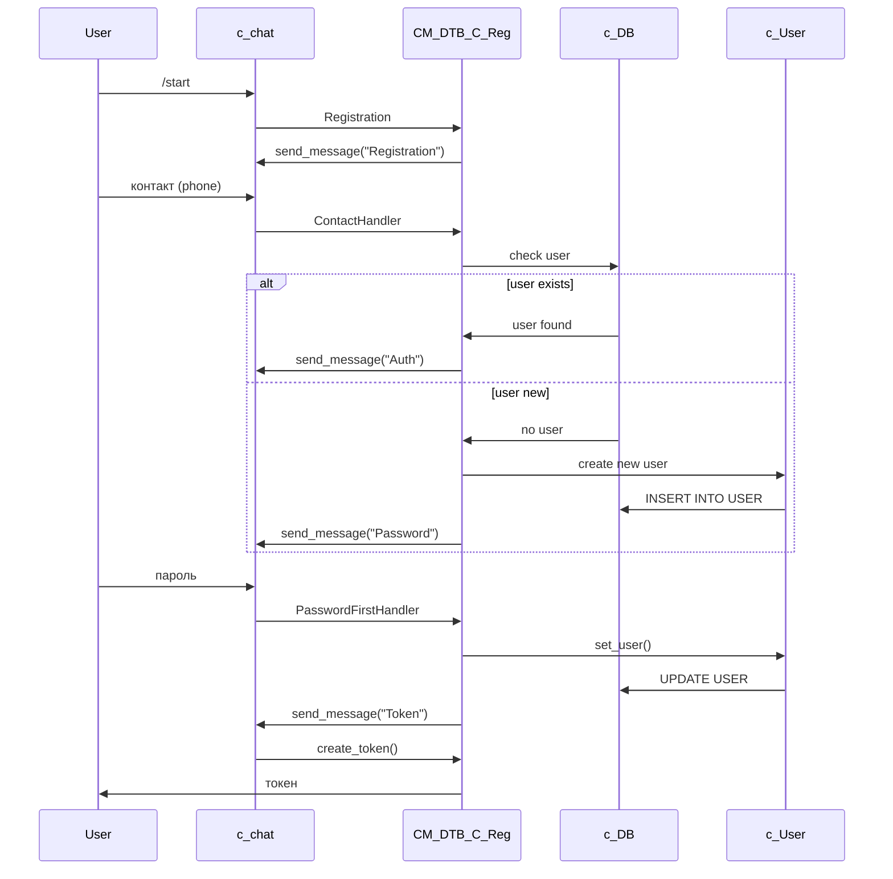

# DTB_Handler — Архитектура (C4 Model)

## Level 1: System Context

Система в контексте внешних акторов и зависимостей.



**Описание:**
- **DTB_Handler** — мультиплатформенный бот-фреймворк
- **Пользователи** — взаимодействуют через мессенджеры
- **Внешние API** — Telegram, MAX, VK для отправки/получения сообщений
- **SQLite** — локальная база данных

---

## Level 2: Containers

Технологические контейнеры и потоки данных между ними.

```mermaid
graph TB
    subgraph "Python Process"
        subgraph "Telegram Container"
            TLG_BOT[DTB_Bot_Tlg.py<br/>pyTelegramBotAPI<br/>SOCKS5 Proxy]
        end

        subgraph "MAX Container"
            MAX_BOT[DTB_Bot_Max.py<br/>requests + REST API<br/>platform-api.max.ru]
        end

        subgraph "VK Container"
            VK_BOT[DTB_Bot_Vk.py<br/>vk_api<br/>long-poll/Webhook]
        end

        subgraph "Core Container"
            CFG[DTB_Cfg.py<br/>JSON Config]
            CHAT[DTB_Chat.py<br/>Session Manager]
            USER[DTB_User.py<br/>User Manager]
            TOKEN[DTB_Token.py<br/>Token Manager]
            CM[Command Modules<br/>CM/DTB_C_*.py]
            RES[DTB_Res.py<br/>Messages & Texts]
            LOG[DTB_Log.py<br/>Logging]
            UTILS[DTB_Utils.py<br/>Hash + Token Gen]
        end

        subgraph "Data Container"
            DB[DTB_DB.py<br/>SQLite ORM<br/>DTB_DB.db]
        end

        subgraph "Scheduler Container"
            TIMER[DTB_Timer.py<br/>Background Tasks]
        end
    end

    TLG_BOT -->|gate()| CHAT
    MAX_BOT -->|gate()| CHAT
    VK_BOT -->|gate()| CHAT
    CHAT -->|CRUD| DB
    CHAT -->|auth| USER
    CHAT -->|token| TOKEN
    CHAT -->|route| CM
    CHAT -->|texts| RES
    USER -->|hash| UTILS
    TIMER -->|cleanup| DB
    TIMER -->|ping| TLG_BOT
    TIMER -->|ping| MAX_BOT
    CFG -->|config| CHAT
```

**Описание контейнеров:**

| Контейнер | Технология | Назначение |
|-----------|-----------|------------|
| Telegram | pyTelegramBotAPI | Обработка событий Telegram, SOCKS5 proxy |
| MAX | requests + REST | Обработка событий MAX Platform |
| VK | vk_api | Обработка событий ВКонтакте |
| Core | Python 3.x | Логика сессий, пользователей, токенов |
| Data | SQLite | Персистентное хранение |
| Scheduler | threading.Timer | Фоновые задачи (очистка, пинг) |
| Config | JSON | Конфигурация ботов и параметров |

---

## Level 3: Components

Детальная разбивка ключевых контейнеров.

### 3.1 Container: Core



### 3.2 Container: Telegram



### 3.3 Container: MAX



### 3.4 Container: Data



---

## Level 4: Code (Class Diagram)

Ключевые классы и их отношения.



---

## Потоки данных

### 4.1 Входящее сообщение



### 4.2 Регистрация пользователя



---

## Словарь компонентов

| Компонент | Файл | Роль |
|-----------|------|------|
| **c_Bot** | BOT/DTB_Bot.py | Абстрактный базовый класс бота |
| **c_BotTelegram** | BOT/DTB_Bot_Tlg.py | Telegram-бот (pyTelegramBotAPI) |
| **c_BotMax** | BOT/DTB_Bot_Max.py | MAX-бот (REST API) |
| **c_chat** | DTB_Chat.py | Сессия чата, центральный роутер |
| **c_User** | DTB_User.py | Модель пользователя |
| **c_token** | DTB_Token.py | Временный токен с таймером |
| **c_DB** | DTB_DB.py | SQLite ORM, потокобезопасный |
| **CM_*** | CM/DTB_C_*.py | Обработчики команд |
| **DTB_Res** | DTB_Res.py | Загрузка текстов из JSON |
| **DTB_Timer** | DTB_Timer.py | Фоновые задачи (очистка, пинг) |
